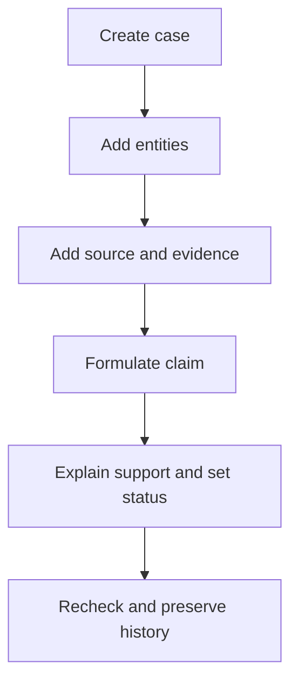
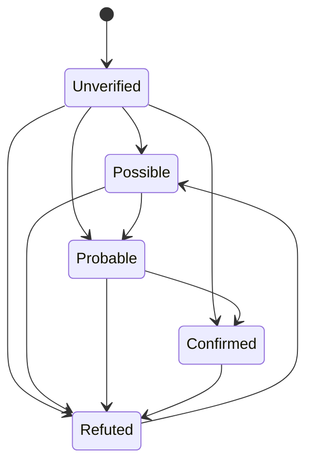
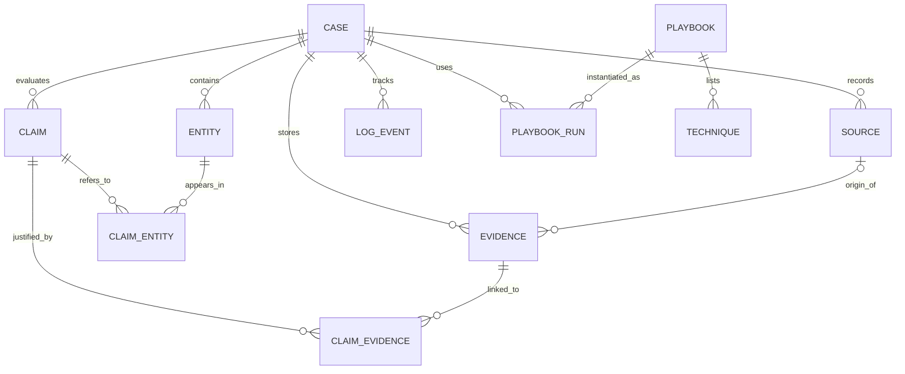
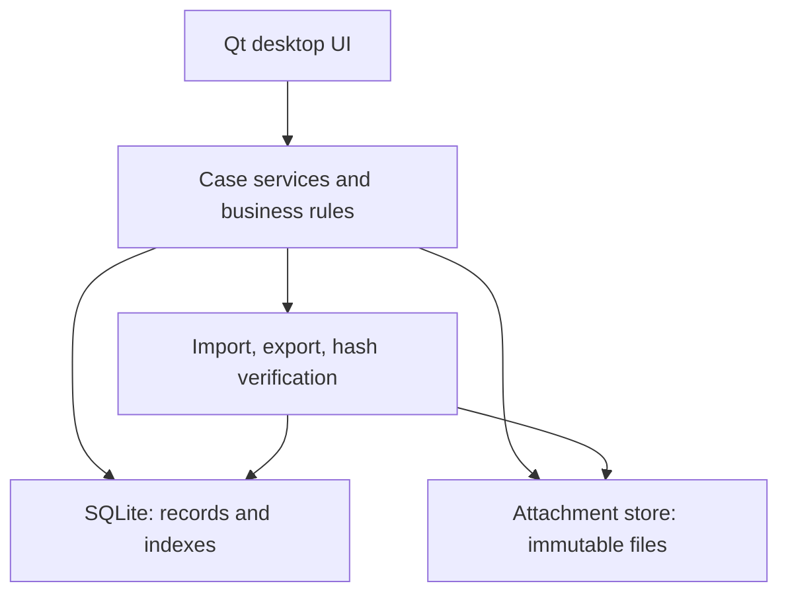

# Evidence Trace — OSINT Workbench Specification

Status: Approved

**Document version:** 1.3 · **Date:** 2026-10-01 · **Primary product language:** English · **Localization:** Ukrainian deferred; frozen in the current documentation phase

> **Verification baseline (historical):** Source document for the implemented MVP. The C++20/Qt 6 Widgets application, SQLite storage, CLI, and core acceptance suite were verified on 2026-09-25. The current GUI also has a shared responsive visual system with readable cards, tables, empty states, tooltips, and small-window scrolling; these presentation improvements do not change the stored data model. “Must” and “shall” continue to define required behavior; the current acceptance matrix records what was actually verified. The GUI provides a focused relationship map for stored binary claims; a dedicated timeline and advanced graph tooling remain extensions.

## Contents

1. [Purpose and scope](#1-purpose-and-scope)
2. [Terms and confidence rules](#2-terms-and-confidence-rules)
3. [Releases and feature scope](#3-releases-and-feature-scope)
4. [User workflows](#4-user-workflows)
5. [Functional requirements](#5-functional-requirements)
6. [User interface](#6-user-interface)
7. [Data model](#7-data-model)
8. [Architecture and storage](#8-architecture-and-storage)
9. [Security and privacy](#9-security-and-privacy)
10. [Acceptance criteria](#10-acceptance-criteria)
11. [Implementation plan](#11-implementation-plan)
12. [Open decisions](#12-open-decisions)
13. [References](#13-references)

## 1. Purpose and scope

**Evidence Trace** is a local application for managing OSINT investigations. It keeps entities, claims, sources, preserved evidence, relationships, investigative methods, and the sequence of actions in a single case. Its main purpose is to let an investigator resume work months later and reconstruct **what was established, what supports it, and how it was found**.

**Initial user:** one investigator on their own computer. **Initial platform:** Linux desktop, with no account or cloud server. The implemented GUI stack is Qt 6 Widgets with C++20 and SQLite. This is a project architecture choice, not a general requirement of OSINT.

### Goals

| ID | Goal | Evidence of completion |
| --- | --- | --- |
| G-01 | Keep investigation material in one case | Entities, claims, sources, attachments, and notes are accessible from the case. |
| G-02 | Preserve the provenance of conclusions | Each claim shows its evidence, source, date, and reasoning from observation to conclusion. |
| G-03 | Preserve personal methodology | Technique templates can be reused while execution is recorded separately for each case. |
| G-04 | Resume an investigation later | An activity log and backup preserve context and data. |
| G-05 | Manage uncertainty | Refuted and unverified claims remain visible with their correct status. |

### First-release boundaries

The application **does not identify people automatically**, guarantee that records are true, establish legal admissibility of evidence, or present automated matches as established facts. It works with information entered or imported by the user. External-service requests, network scanning, and face search are outside the MVP.

**Language policy:** English is the source language for the interface, field labels, built-in playbooks, error messages, reports, and documentation. Internal identifiers and serialized enum values stay language-independent and stable. Ukrainian localization comes later through externalized translation strings; user-entered case data is never machine-translated without an explicit user action. The locale affects display text, date/number formatting, and report labels, but does not change stored IDs or UTC timestamps.

## 2. Terms and confidence rules

Implementation status: Partial. Core behavior is Implemented; limitations and Planned requirements are listed in the implementation-status record below. Normative requirements are retained and do not become implemented merely because they appear here.

| Term | Meaning | Example |
| --- | --- | --- |
| Case | A container for one investigation, with a title, purpose, and scope. | “Profile connection to Company X.” |
| Entity | An object about which information is collected. | Person, account, domain, company. |
| Source | The origin of information. | Profile URL, registry name, document author. |
| Evidence | A preserved or added item that can be reviewed. | Screenshot, PDF, saved page text. |
| Claim | A testable statement about an entity or relationship. | “Account A belongs to Person B.” |
| Relation | A claim connecting two entities with a typed predicate. | `Account A — belongs_to → Person B`. |
| Provenance | The source, acquisition method, time, and author of a record. | “Found in a commit; checked against a profile.” |
| Technique | A reusable investigation instruction. | Search commit history for an exact username. |
| Playbook | An ordered template of techniques for a task. | Username investigation. |
| Playbook run | A separate copy of a checklist in a specific case. | Steps performed for `john1337`. |

**Core invariant:** confidence belongs to a **claim or relation**, never to an entity or to a source as a whole. An account may demonstrably exist while the claim that it belongs to a particular person is still only a hypothesis.

The new claim or relation form keeps the `observation`/`inference` kind selectable for both entity claims and directional relations; directional relations default to `inference` for compatibility with the usual hypothesis workflow.

Claim statuses are `unverified` (evidence has not yet been evaluated), `possible` (weak indication), `probable` (multiple consistent indicators or strong indirect support), `confirmed` (the investigator records sufficient direct support), and `refuted` (the claim has been contradicted sufficiently to reject it). `confirmed` is a documented human assessment, not a mathematical or legal guarantee. Each status change records the previous and new values in the activity log. **Refuted claims remain in the history.**

Each claim has a `reasoning` field explaining why particular evidence supports or contradicts it. A URL alone does not prove a claim. Publication time, event time, and capture time are distinct fields.

## 3. Releases and feature scope

Implementation status: Implemented for the core MVP scope; Planned for the later-release column. Exceptions to full MVP coverage are recorded below.

| Component | MVP (v0.1) | Later releases |
| --- | --- | --- |
| Cases, entities, search | Create, edit, archive/restore, filter, explicit permanent delete | Batch import. |
| Sources, evidence, claims | Manual entry, attachments, links, SHA-256 for files | Web-page capture, link checking. |
| Relations | Relation table, entity detail page, and focused interactive map for stored binary relations | Dense-case layout tooling, richer graph filters, and automatic inference visualization. |
| Playbooks | Templates, techniques, and case-specific runs | Suggested next steps. |
| Activity log | Automatic events and manual “how I found it” entries | Extended import/export audit. |
| Export and recovery | Case archive and reimport; text report | PDF report, selective export. |
| Tools | Open external URLs manually | RDAP/DNS, metadata, username, image, and supported PimEyes integration. |
| Timeline | Event dates in records | Dedicated timeline view. |
| Language | English UI and documentation | Ukrainian localization. |

**The MVP is complete only when every applicable acceptance criterion in Section 10 passes.** A deferred feature must not be presented as implemented.

## 4. User workflows

Implementation status: Partial. Core behavior is Implemented; limitations and Planned requirements are listed in the implementation-status record below. Normative requirements are retained and do not become implemented merely because they appear here.

### 4.1. From a username to a justified relation

1. Create a case with a title, purpose, target, and investigation scope.
2. Add `Username: john1337` and `Person: John Doe` as separate entities.
3. Add a source with a profile URL, preserve a screenshot, and record the acquisition time.
4. Create the claim `john1337 belongs_to John Doe`, attach the screenshot, and explain which visible indicators support the relation.
5. Set the claim to `possible`. After an independent check, attach another item and change the status with an explanation.
6. Months later, open the relation and review both items and the decision history.

### 4.2. Reuse an investigative method

Create a `Username investigation` playbook containing a “check commit history” technique. Start a run in a case, mark the step complete, and record the result URL. Changing the global template a month later **must not retroactively change** that completed case checklist.

### 4.3. Record a disputed or negative result

Find two identical usernames. Record the shared-owner hypothesis as `possible`. Later, attach contradicting evidence and change it to `refuted`. The report must not present the relation as established, while the case history must retain the rejected hypothesis.

## 5. Functional requirements

Implementation status: Partial. Core behavior is Implemented; limitations and Planned requirements are listed in the implementation-status record below. Normative requirements are retained and do not become implemented merely because they appear here.

### 5.1. Cases — FR-CASE

- **FR-CASE-01:** Create a case with a required title and optional purpose, description, primary target type, scope, and tags. Primary target types: `person`, `company`, `place`, `domain`, `username`, `event`, `other`; this selection does not restrict entity types within the case.
- **FR-CASE-02:** List cases with title, last-modified time, `active/archived` status, entity count, and claim count. Search by title and tags.
- **FR-CASE-03:** Editing case metadata must not alter historical records. Archived cases are readable; restoring a case to active status is an explicit action.
- **FR-CASE-04:** Every case record belongs to exactly one case, except global technique and playbook templates. Moving a record between cases is outside the MVP.
- **FR-CASE-05:** The Cases screen provides a context menu with details, edit, archive/restore, and permanent delete actions. Permanent deletion requires explicit confirmation and removes the case's dependent records and preserved attachment files; archiving remains the reversible lifecycle action.

### 5.2. Entities — FR-ENT

- **FR-ENT-01:** Supported types: `person`, `username`, `account`, `email`, `phone`, `domain`, `ip`, `company`, `place`, `url`, `image`, `document`, `event`, `other`. Creating an entity requires a type and short label; additional fields are optional.
- **FR-ENT-02:** An entity page shows its value, aliases, description, tags, related claims, evidence, and change history. Adding an account does not establish who owns it.
- **FR-ENT-03:** Normalize values for search only: domain names case-insensitively; email while preserving the original input; URLs while retaining the exact value entered. Normalization **must not automatically merge** records.
- **FR-ENT-04:** Warn about a possible duplicate within the case and allow both records to remain. Merging is deferred until a release can record the complete history of relinked references.
- **FR-ENT-05:** The entity table provides a context menu for editing, opening the entity's related claims in Claims & Relations, and permanently deleting an entity after confirmation. An entity referenced by claims cannot be deleted until those claims are reviewed; the UI explains the restriction instead of silently invalidating or deleting the claims. Note links are removed with explicit confirmation while the notes remain.

### 5.3. Sources and evidence — FR-EVD

- **FR-EVD-01:** A source stores its type (`web`, `document`, `registry`, `person`, `other`), locator, title, UTC access time, and optional author and reliability note. A source and its local preserved copy are separate records.
- **FR-EVD-02:** Create evidence from a local file or text excerpt. For a file, copy its bytes into case storage and record the original filename, type, size, SHA-256, UTC import time, and optional source URL. Changing the original file afterward must not change the stored copy.
- **FR-EVD-03:** Stored evidence files are not edited in place. A revised version is a new item. “Verify integrity” recomputes SHA-256 and reports a mismatch or missing file. The desktop UI provides read-only in-app previews for text and supported image files, and a metadata-only fallback for unsupported files; it never executes a preserved file.
- **FR-EVD-04:** A quotation stores its text and precise location within the source: page, section, URL fragment, or note. An empty location displays as “Not specified.”
- **FR-EVD-05:** One evidence item may support multiple claims. Removing a link must not delete the file. Deleting an item linked to claims requires explicit confirmation and leaves a log event.
- **FR-EVD-06:** A URL without a preserved copy displays `external only` because its content may have changed. Automated page capture is a separate future module.

### 5.4. Claims and relations — FR-CLM

- **FR-CLM-01:** A claim has a statement, `observation/inference` kind, status, `reasoning`, recorded-by identifier, creation time, and last-modified time. `reasoning` is required for an inference.
- **FR-CLM-02:** A claim refers to one or more entities. A binary relation has a `subject`, typed `predicate`, and `object`; direction matters. Predicates are extensible, with initial examples `owns`, `uses`, `works_for`, `registered_to`, and `mentioned_in`.
- **FR-CLM-03:** A claim may link several evidence items, each with a `supports/contradicts/context` role. The UI may select an existing preserved item or import a new local file into the current case before creating the link; the exact evidence ID is persisted. When a new claim or relation is given initial status `confirmed`, the desktop UI opens the supporting-evidence step before creation and persists the selected/imported link with the claim. Moving to `confirmed` requires at least one `supports` item and written reasoning. This is a UI safeguard, not proof that the claim is true.
- **FR-CLM-04:** Changing the status, statement, or evidence links creates a log event. Contradictory items remain attached when the status changes.
- **FR-CLM-05:** The relation table shows both entities, predicate, status, and counts of supporting and contradicting items. Filter by entity, predicate, or status. An interactive graph is not required for the MVP.

The arrows illustrate a typical assessment path, **not a restriction on transitions**. After new evidence, the user may select any status, but must explain the change; the system records the previous state. The GUI relationship map visualizes these stored directional claims and does not infer new edges.

### 5.5. Playbooks and techniques — FR-PLY

- **FR-PLY-01:** A global technique stores a name, objective, steps, example queries, tools/links, limitations, and tags. Example queries are stored as text; they are not run automatically.
- **FR-PLY-02:** A playbook has a name, scope, and ordered list of techniques. The order is editable.
- **FR-PLY-03:** A playbook run belongs to a case and optionally to an entity. Starting a run saves a **snapshot** of the template's step names and instructions, so later template edits cannot rewrite case history.
- **FR-PLY-04:** A step has `todo/done/skipped` state, completion time, “what I did” note, and links to resulting evidence. The run UI can select an existing case evidence item or import a new preserved file and link that exact item to the selected step. A user may add a step only to the current run or separately save it as a global technique.

### 5.6. Activity log, notes, and search — FR-LOG

- **FR-LOG-01:** The log automatically records creation, status changes, relation changes/deletions, evidence additions, integrity checks, playbook runs/steps, exports, and imports. An event stores UTC time, type, object ID, action, and readable description.
- **FR-LOG-02:** Users can add “how I found it” notes with steps, queries, observations, unsuccessful checks, and links to entities or evidence. Failed leads are useful results and must be preserved.
- **FR-LOG-03:** Existing log events cannot be edited through the UI; corrections become new events. The MVP provides an in-application activity history, **not a cryptographically tamper-proof audit trail** against the machine's owner.
- **FR-LOG-04:** Case search covers entity labels, claim text, source URLs, filenames, notes, and technique names; filter by type and date. The top-bar search additionally searches these record types across cases and opens the selected case/record. Full-text indexing inside attached PDFs or images is outside the MVP.

### 5.7. Export and import — FR-EXP

- **FR-EXP-01:** `Export case` creates a portable ZIP containing `case.json` with format/schema version, `attachments/` with files, and `manifest.json` with paths, sizes, and SHA-256 hashes. The archive includes log events and playbook-run snapshots; it does not export the global template database with the case.
- **FR-EXP-02:** Before import, validate the schema version, archive structure, sizes, every SHA-256 hash, and unsafe paths (`../`, absolute paths, symlinks). On error, create no partial case and show a list of problems.
- **FR-EXP-03:** If an imported case ID already exists, offer “skip” or “import as copy”; remap all internal references consistently in the copy. Do not overwrite the existing case.
- **FR-EXP-04:** A separate Markdown report includes purpose, entity list, claims with statuses, evidence references, brief chronology, and open questions. Separate `refuted` and `unverified` claims from confirmed conclusions; display generation date and a note that assessments are manual.
- **FR-EXP-05:** The case archive and Markdown report are different actions: the report is for reading, the archive for restoring data. Export does not delete the case.

## 6. User interface

Implementation status: Partial. Core behavior is Implemented; limitations and Planned requirements are listed in the implementation-status record below. Normative requirements are retained and do not become implemented merely because they appear here.

**Top-level navigation:** `Cases`, `Playbooks`, `Settings`. Inside a case: `Overview`, `Entities`, `Claims & Relations`, `Sources & Evidence`, `Notes & Log`, `Playbook Runs`, `Export`. Tables support opening an item, filtering, sorting, and returning to the prior selection.

| Screen | Primary actions | Required visible information |
| --- | --- | --- |
| Case list | Create, search, archive, open | Title, status, last update. |
| Case overview | Add entity, claim, or evidence | Purpose, scope, counts, recent activity, unresolved claims. |
| Entity details | Edit, inspect possible duplicate, follow a relation | Type, value, associated claims and sources. |
| Claim details | Change status, attach evidence, explain reasoning | Status, rationale, support/contradictions, history. |
| Evidence details | Preview safely in the application, check SHA-256, open source | URL, import time, filename, hash, linked claims. Unsupported files and external-only URLs have explicit no-execution/no-navigation fallbacks. |
| Playbook run | Complete a step, add result | Step state, notes, evidence, instruction snapshot. |
| Activity log | Filter, add manual entry | Event and time shown consistently as `YYYY-MM-DD HH:MM UTC`. |

Errors and empty states must be specific: “Attach at least one supporting item before marking this claim confirmed,” “File changed or unavailable,” “Import rejected: SHA-256 mismatch.” Forms must warn before discarding unsaved text.

**FR-UI-01:** Every actionable record table in the desktop UI provides a context menu that exposes the supported operation for the selected row: open/view details, edit or update, link evidence, navigation to related records, or a clearly explained copy/correction action for immutable history. Destructive operations require explicit confirmation. The service layer protects referenced records and reports the blocking relationship instead of silently deleting dependent data. Settings and Export screens are command panels rather than record tables and therefore do not require row menus.

## 7. Data model

Implementation status: Partial. Core behavior is Implemented; limitations and Planned requirements are listed in the implementation-status record below. Normative requirements are retained and do not become implemented merely because they appear here.

### 7.1. Main records

`CLAIM_ENTITY` specifies a `subject/object/context` role. A relation requires exactly one subject, one object, and a predicate; a simple claim requires at least one entity. `CLAIM_EVIDENCE` has a `supports/contradicts/context` role and optional note. `PLAYBOOK` and `TECHNIQUE` exist outside cases; `PLAYBOOK_RUN` owns copies of its steps.

| Table | Key fields | Rule |
| --- | --- | --- |
| `cases` | `id`, `title`, `purpose`, `scope`, `status`, `created_at`, `updated_at` | UUID IDs; UTC times. |
| `entities` | `id`, `case_id`, `type`, `label`, `canonical_value`, `details_json` | Controlled type list; preserve original input. |
| `sources` | `id`, `case_id`, `type`, `locator`, `title`, `accessed_at` | One URL may be linked to several items. |
| `evidence` | `id`, `case_id`, `source_id?`, `kind`, `relative_path?`, `sha256?`, `captured_at`, `imported_at`, `note` | Path and hash required for files. |
| `claims` | `id`, `case_id`, `statement`, `kind`, `predicate?`, `status`, `reasoning`, `created_at`, `updated_at` | Status is not inherited from a source. |
| `claim_entities` | `claim_id`, `entity_id`, `role` | Both records belong to the same case. |
| `claim_evidence` | `claim_id`, `evidence_id`, `role`, `note` | A link cannot move evidence across cases. |
| `techniques`, `playbooks`, `playbook_steps` | `id`, `name`, `description`, `position` | Global templates. |
| `playbook_runs`, `run_steps` | `id`, `case_id`, step-text snapshot, state, result | Historical copy independent of its template. |
| `log_events` | `id`, `case_id`, `occurred_at`, `action`, `object_type`, `object_id`, `payload_json` | Events cannot be edited through the UI. |

**Database constraints:** enable foreign keys; index `case_id`, `updated_at`, `status`, normalized entity value, and source URL. Validate same-case references in the service layer and during export. Avoid `ON DELETE CASCADE` on evidence when it would silently remove a claim's basis: explicitly unlink it or reject deletion first.

### 7.2. Time and versioning

Store timestamps in ISO 8601 UTC; the current desktop UI and Markdown report use the explicit convention `YYYY-MM-DD HH:MM UTC` (the underlying values retain ISO-8601 precision). Store `event_time` (when the described event occurred) separately from `captured_at` (when evidence was obtained) and `imported_at` (when it entered the application). If the precise time is unknown, store a date/range and precision indicator; do not invent `00:00`.

The case format includes `schema_version`. Database migrations are sequential and tested against a copy; opening an unknown newer version must not modify files. Create a backup before migration.

## 8. Architecture and storage

Implementation status: Partial. Core behavior is Implemented; limitations and Planned requirements are listed in the implementation-status record below. Normative requirements are retained and do not become implemented merely because they appear here.

**Implemented storage layout:** one SQLite database for metadata and templates, with attachments in an application-managed directory named by opaque IDs rather than user-supplied filenames. The data directory is configurable. Back up the database and attachments as a unit, preferably through the built-in export. A relative path from the database must always resolve inside the designated attachment directory. The MVP does not require network access.

**Transactional behavior:** copy an imported file to a temporary location and compute its hash, record metadata in a database transaction, then atomically move the file to its final location. A failed operation cleans up temporary files. On startup, the application detects orphaned temporary files and offers safe cleanup. This specifies the intended recovery behavior; SQLite and the filesystem do not form one atomic transaction.

**Recovery:** the user can export a case or back up all application data. Verify a backup by importing it into a separate data directory and checking hashes again. Copying an open database and attachments without a coordinated snapshot is not considered a reliable backup.

**Future modules:** each module receives typed input, identifies the external service and the type and time of its request, and returns candidate results with raw provenance. The user decides what enters the case. A module cannot set `confirmed` automatically. A feature module may add RDAP/DNS results; an image module may extract metadata or open a manual search link. PimEyes results may be entered manually or integrated through an officially available, permitted route, without bypassing service restrictions. Review third-party APIs, pricing, and terms before implementing each integration.

## 9. Security and privacy

Implementation status: Partial. Core behavior is Implemented; limitations and Planned requirements are listed in the implementation-status record below. Normative requirements are retained and do not become implemented merely because they appear here.

- OSINT cases may contain personal data. By default, everything is stored locally, with **no background requests or telemetry** in the MVP. Opening an external URL or using a future module explicitly shows what will be sent outside the application.
- Restrict data-directory permissions to the current user. The MVP does not claim to encrypt storage; full-disk encryption is needed to protect a lost device. Application-level encryption is a separate future requirement.
- Archives, reports, and screenshots may contain sensitive material. Show the data included before export. The MVP has no automatic anonymization; review a report manually before sharing it.
- Import must not execute embedded scripts, open URLs automatically, or write files outside the import destination. Limits on file count, file size, and total uncompressed size prevent uncontrolled disk use.
- SHA-256 detects a file change **relative to the stored hash**. By itself, it does not prove that the content was authentic when captured or that a local database was not altered. Strict chain-of-custody requirements need separate signing, time attestation, and procedural controls.
- The user defines a legitimate investigation purpose and scope. The application does not include covert surveillance, mass collection of personal information, or automatic circumvention of service protections.

## 10. Acceptance criteria

Implementation status: Partial for complete verification. These are required scenarios, not a claim that every GUI interaction or benchmark has been checked. See [acceptance results](acceptance.md).

These MVP scenarios are verifiable. The `AC-ID → action → expected result` format can serve as both a release checklist and a test plan.

| ID | Action | Expected result |
| --- | --- | --- |
| AC-01 | Create a case, close the application, and reopen it | The case and its metadata persist unchanged. |
| AC-02 | Add two entities, a `belongs_to` relation, and `possible` status | The relation appears on both entity pages and in the table; entities themselves have no confidence status. |
| AC-03 | Try to mark a claim `confirmed` without supporting evidence | The operation is rejected with an explanation. |
| AC-04 | Add a file, change its original outside the application, and check the preserved copy | The internal copy is unchanged and its SHA-256 still matches. |
| AC-05 | Change the bytes of the internal copy and verify integrity | A mismatch appears; no claim status changes automatically. |
| AC-06 | Attach one item to two claims, then remove one link | The item remains available to the second claim. |
| AC-07 | Change `possible → refuted` with an explanation | Both statuses, time, and explanation remain in the log; the report does not present the claim as confirmed. |
| AC-08 | Start a playbook run, finish a step, then edit the global template | The previous run and its result remain unchanged. |
| AC-09 | Export a case and import it into a clean database | Counts, references, log, text, and hashes match; files open correctly. |
| AC-10 | Import an archive with a modified attachment or `../` path | The entire import is rejected; no partial case is created. |
| AC-11 | Search for a username, URL, and phrase from a note | The appropriate records are found within the current case. |
| AC-12 | Add a source consisting only of a URL | The UI shows `external only` and does not imply that the page was preserved locally. |
| AC-13 | Right-click a case and permanently delete it after confirmation | The dependent records and preserved attachment files are removed; cancelling the warning leaves the case unchanged. |
| AC-14 | Right-click an entity and use edit, see related claims, and delete | Edit opens the entity form; related claims open Claims & Relations filtered to that entity; an unreferenced entity is deleted after confirmation, while an entity referenced by claims is protected with an explanatory message. |
| AC-15 | Right-click representative rows in Cases, Entities, Claims & Relations, Sources & Evidence, Playbook Runs, Playbooks, Notes & Log, and the Overview tables | Each actionable row exposes a real supported operation; edit/update/navigation/copy actions execute against the selected record, destructive actions require confirmation, and referenced records are protected with an explanatory error. |

**Initial quality target:** a typical case with up to 1,000 entities, 5,000 claims, and 2,000 attachments remains usable on an ordinary laptop; searches across text fields should take approximately one second or less. These are design targets, **not achieved benchmarks** until measured. Automate checks for database constraints, file lifecycle, playbook snapshot immutability, export/import round trips, and malformed-archive rejection.

## 11. Implementation plan

Implementation status: Implemented for core stages 1–5, subject to the limitations below. Planned for stage 6 beyond the existing focused relationship map.

1. **Foundation:** database schema, migrations, local storage, create/open case, and basic navigation. Delivers AC-01.
2. **Investigation data:** entities, sources, file import and SHA-256, claims, and relations. Delivers AC-02–AC-06 and AC-12.
3. **Work context:** activity log, notes, search, statuses, and reasoning. Delivers AC-07 and AC-11.
4. **Methodology:** techniques, playbooks, and run snapshots. Delivers AC-08.
5. **Portability:** ZIP export, validation and import, and Markdown report. Delivers AC-09–AC-10. Then run the complete MVP acceptance suite.
6. **Extensions:** graph, timeline, RDAP/DNS, metadata, username search, and controlled image-search integrations. Specify and test each separately.

The implementation baseline has been split into `README.md` (purpose and actual startup instructions), `docs/user/` (task-oriented usage), `docs/spec/` (rules, data, acceptance criteria), `docs/development/` (build, architecture, migrations, tests), and `CHANGELOG.md`. Installation and build commands in the README are kept only after the Qt/SQLite stack was implemented and verified.

## 12. Open decisions

| Question | Current design decision | Resolve when |
| --- | --- | --- |
| UI stack | C++20 with Qt 6 Widgets on Linux; verified with the current CMake build. | Completed for the MVP baseline. |
| Maximum attachment size | Implemented: AttachmentStore defaults to 100 MiB; callers can supply a limit. | Revisit for measured workloads. |
| Case deletion | Implemented: archive/restore and confirmed permanent deletion; deletion stages files for failure recovery. | Validate native GUI cancellation and recovery procedures. |
| Encryption | Outside MVP; rely on full-disk encryption. | Before moving sensitive data between devices. |
| Multiple users | Outside MVP; the database is designed for one user. | Before enabling sharing. |
| Web capture and PimEyes | Outside MVP; verify technical, legal, and service conditions. | Before implementing an integration. |
| Ukrainian localization | Planned: future localization; English remains maintained and mb_remeber is frozen under the approved documentation policy. | Only after explicit owner direction. |

## Implementation-status record — 2026-10-01

This revision preserves intended requirements and records present gaps; it does not approve code changes. The [documentation policy](../policy/project_documentation_policy.md) governs maintenance; the [module registry](../internal_spec/modules_registry.md) maps code ownership.

| Area | Status | Current evidence and remaining requirement |
| --- | --- | --- |
| Cases, records, evidence integrity, claims, run snapshots, ZIP/report workflows | Implemented | Current service source and integration test source; existing integration executable passed on 2026-10-01 without rebuilding. |
| Entity normalization and duplicate warning | Partial | Service normalization/duplicate lookup exists; full GUI workflow coverage was not freshly checked. |
| FR-LOG-04 text search and filters | Partial | Current search(case_id, query) matches record text and run-step snapshots. A type/date-filter service interface is absent. Attachment indexing is Planned. |
| Event time and unknown date/range precision in section 7.2 | Planned | Current records expose capture/import and normal UTC record timestamps; separate event-time/range/precision fields are absent from the current domain/schema. |
| Startup temporary-file cleanup in section 8 | Partial | Current adapters automatically remove .tmp-* material and recover .delete-* quarantine by database ownership. The specified interactive safe-cleanup offer is absent. |
| Confirmation safeguards | Implemented | Supporting evidence and reasoning are required at creation/status change to confirmed. Later unlink/deletion does not automatically downgrade an existing claim. |
| Native GUI interaction, unsaved-form warnings, and complete filter/sort coverage | Partial | Historical offscreen rendering is recorded in acceptance.md. Native interaction and these broader workflow requirements remain to be checked. |
| Focused relationship map | Implemented | GUI displays stored binary relations; no inferred edges. |
| Dedicated timeline, advanced graph tooling, integrations, PDF reports, encryption, localization | Planned | These remain extensions; Ukrainian reference maintenance is frozen. |
| Quality target in section 10 | Planned | No measured benchmark is claimed. |

The historical verification dates describe the earlier baseline. The current source was inspected during this migration, but no fresh build, screenshot run, performance measurement, or native interaction test is claimed. Remaining requirements must not be removed merely to match implementation.

## 13. References

This is an **original Evidence Trace specification**, not a description of the products below. These sources informed documentation structure and relevant design patterns:

1. [GitLab — Folder structure for documentation](https://docs.gitlab.com/development/documentation/site_architecture/folder_structure/): separate user and developer material and document features near their related area.
2. [SpiderFoot — README](https://github.com/smicallef/spiderfoot/blob/master/README.md): examples of automated OSINT modules, export formats, and SQLite; useful for setting the boundary of future integrations.
3. [Maltego — Running Transforms](https://docs.maltego.com/en/support/solutions/articles/15000009613-running-transforms): an example of entity-specific actions; in Evidence Trace, integration results require human assessment.
4. [Hunchly — Exporting and Importing Cases](https://support.hunch.ly/article/30-11-exporting-cases) and [Content, Photo and Attachment Hashing](https://support.hunch.ly/article/52-2-content-photo-and-attachment-hashing): portable cases, attachment verification, and the limits of hashes as evidence of authenticity.

**Maintenance rule:** for each release, update the feature matrix, actual installation procedure, schema version, export behavior, and criteria that passed verification. Keep planned features explicitly marked as planned.
