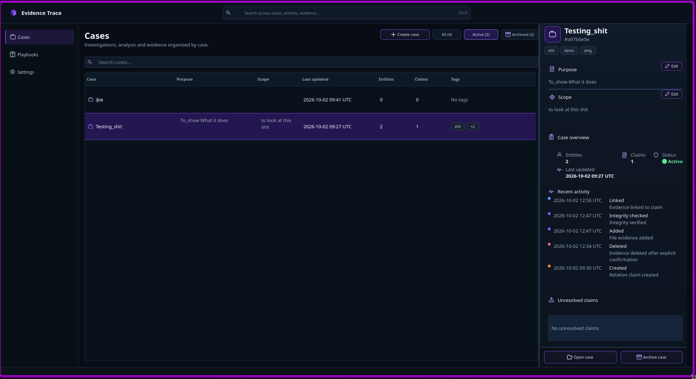
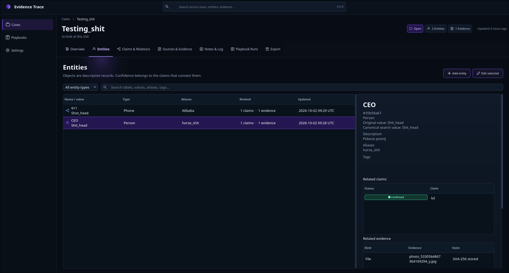
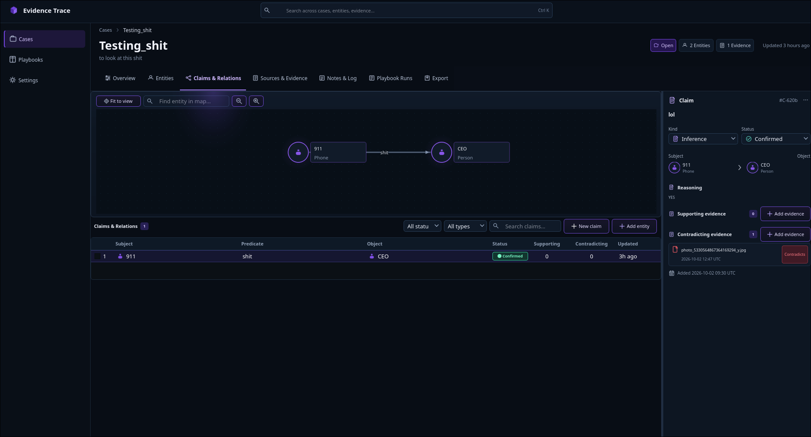

Target: `README.md`
Operation: replace
Proposal revision: 1

## Reason and affected documents

Document the Linux desktop launcher, supplied application icon, and maximized startup behavior implemented for the Bazzite KDE Plasma report. Related proposals cover the GUI behavior, product specification, installation guide, and README.

## Discrepancies and verification

The previous installation documented only the executable files; it did not install a desktop entry or icon. The GUI previously showed without requesting maximized state. The GUI target built successfully with CMake, and `cmake --install build --prefix /tmp/evidence-trace-icon-check` installed the executable, desktop entry, and icon. Automated tests were not run.

## Complete proposed target content

<!-- BEGIN PROPOSED CONTENT -->
# Evidence Trace

Status: Approved

**Evidence Trace is a local-first OSINT investigation workbench.** Build a case,
preserve what you find, connect evidence to claims, and return later with a
clear record of how you reached each assessment.

It runs on Linux as a Qt 6 desktop app with a companion CLI. Case data and
preserved files stay on your device; the app makes no background network
requests or telemetry calls.

## Screenshots

<p align="center">
  
</p>

<p align="center">
  
  
</p>

## Follow the evidence

- **Organize a case:** track entities, sources, claims, relations, notes, and
  investigation activity together.
- **Preserve material:** import files into local storage, record quotations, or
  save an external URL. Imported files are checked with SHA-256.
- **Explain assessments:** attach evidence as support, contradiction, or
  context; keep reasoning and status history with the claim.
- **See relationships:** explore stored entity and claim relationships on a
  case map. The map visualizes records; it does not generate inferences.
- **Resume or share a case:** use playbook runs, portable case ZIP archives
  with import validation, and an English Markdown report.

## Quick start

The supported source installation path is Linux. On Debian or Ubuntu, install
the build dependencies:

```sh
sudo apt update
sudo apt install build-essential cmake qt6-base-dev libsqlite3-dev libssl-dev libzip-dev
```

Download and extract the repository, or clone it with Git. From the project
directory, run:

```sh
./install.sh
```

This builds the Release version, installs the GUI and CLI into
`~/.local/bin`, and registers Evidence Trace in the desktop application menu
with its supplied icon. Add that directory to `PATH` if needed, then launch the
app:

```sh
evidence-trace-gui
```

For command-line workflows, start with:

```sh
evidence-trace --help
```

See the [build and installation guide](docs/development/build.md) for
prerequisites, CMake instructions, and install options, and the
[CLI guide](docs/user/cli.md) for commands and examples.

## Data and limitations

Evidence Trace stores its database and copied attachments in a local data
directory. Export case ZIPs regularly and verify that an archive can be
imported when you need a backup. Hash verification detects changes to a stored
file; it does not prove who created the file or protect the database from the
device owner.

The app does not automatically collect web pages or query external OSINT
services. It has no encryption, cloud sync, multi-user accounts, PDF report, or
full-text indexing of PDFs and images. Review the
[current behavior and limitations](docs/spec/evidence-trace-spec.md) before
using it for an investigation workflow.

## Project links

- [Product specification](docs/spec/evidence-trace-spec.md)
- [Architecture](docs/development/architecture.md)
- [CLI usage](docs/user/cli.md)
- [Build and installation](docs/development/build.md)
- [Test guide](docs/development/tests.md)
- [Acceptance matrix](docs/spec/acceptance.md)
- [GUI design references](docs/design/gui/README.md)
<!-- END PROPOSED CONTENT -->
